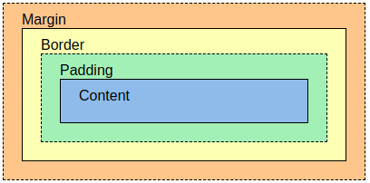

# Tech Bazaar
**Tautan Web:** [daffa-rayhan-techbazaar.pbp.cs.ui.ac.id](http://daffa-rayhan-techbazaar.pbp.cs.ui.ac.id/)

- [Tugas 2](#tugas-2)
- [Tugas 3](#tugas-3)
- [Tugas 4](#tugas-4)
- [Tugas 5](#tugas-5)
- [Tugas 6](#tugas-6)
## Tugas 2
### Langkah-langkah mengimplementasikan *checklist* pada tugas 2
- Buat  *virtual environment* dengan menjalankan perintah `python -m venv env` pada direktori yang diiginkan. Misal di direktori `tech-bazaar`.
- Aktifkan *virtual environment* dengan perintah `env\Scripts\activate`.
- Di dalam direktori yang sama, buat berkas `requirements.txt` dan tambahkan beberapa *dependencies*.
    ```
    django
    gunicorn
    whitenoise
    psycopg2-binary
    requests
    urllib3
    ```
- Lakukan instalasi terhadap *dependencies* yang ada dengan perintah `pip install -r requirements.txt`.
- Buat proyek Django bernama `tech_bazaar` dengan perintah `django-admin startproject tech_bazaar .`.
- Tambahkan kedua string berikut pada `ALLOWED_HOSTS` di `settings.py` untuk keperluan deployment:
    ```
    ...
    ALLOWED_HOSTS = ["localhost", "127.0.0.1"]
    ...
    ```
- Tambahkan juga `'main'` ke dalam daftar aplikasi yang ada sebagai elemen paling terakhir. Daftar aplikasi dapat  diakses pada variabel INSTALLED_APPS.
    ```
    INSTALLED_APPS = [
        ...,
        'main'
    ]
    ```
- Buat aplikasi dengan nama `main` menggunakan perintah `python manage.py startapp main`. Perhatikan bahwa tercipta direktori baru `main`.
- Buka berkas `models.py` pada direktori aplikasi `main`.
- Isi berkas `models.py` dengan kode berikut.
    ```py
    from django.db import models

    class Product(models.Model):
        name = models.CharField(max_length=255)
        price = models.IntegerField()
        description = models.TextField()
        stock = models.IntegerField()

        @property
        def is_expensive(self):
            return self.price>2000
        
        @property
        def is_available(self):
            return self.stock>0

    ```
- Jalankan perintah `python manage.py makemigrations` untuk membuat migrasi model.
- Jalankan perintah `python manage.py migrate` untuk menerapkan migrasi ke dalam basis data lokal.
- Buka berkas `views.py` yang terletak di dalam berkas aplikasi `main`.
- Isi berkas `views.py` dengan kode berikut.
    ```py
    from django.shortcuts import render

    def show_main(request):
        context = {
            'app_name' : 'Tech Bazaar',
            'name' : 'Daffa Rayhan Ananda',
            'class' : 'PBP-E'
        }

        return render(request, "main.html", context)

    ```
- Buat direktori `templates` di dalam direktori `main`.
- Buat berkas `main.html` di dalam direktori `templates` dan isilah berkas tersebut dengan teks berikut.
    ```html
    ...
    <h1>Tech Bazaar</h1>

    <h5>App Name: </h5>
    <p>{{ app_name }}</p> 
    <h5>Name: </h5>
    <p>{{ name }}</p> 
    <h5>Class: </h5>
    <p>{{ class }}</p>
    ...
    ```
- Buat berkas `urls.py` di dalam direktori `main`.
- Isi `urls.py` dengan kode berikut.
    ```py
    from django.urls import path
    from main.views import show_main

    app_name = 'main'

    urlpatterns = [
        path('', show_main, name='show_main'),
    ]
    ```
- Buka berkas `urls.py` **di dalam direktori proyek `tech_bazaar`, bukan yang ada di dalam direktori aplikasi `main`**.
- Impor fungsi `path` dan `include` dari `django.urls`.
    ```
    ...
    from django.urls import path, include
    ...
    ```
-  Tambahkan rute URL seperti berikut untuk mengarahkan ke tampilan `main` di dalam variabel `urlpatterns`.
    ```
    urlpatterns = [
        ...
        path('', include('main.urls')),
        ...
    ]
    ```
- Pada direktori utama `tech-bazaar` lakukan perintah `git init` untuk menetapkan direktori ini sebagai *repository* lokal.
- Tambahkan berkas `.gitignore` dan isilah berkas tersebut dengan teks berikut.
    ```
    # Django
    *.log
    *.pot
    *.pyc
    __pycache__
    db.sqlite3
    media

    # Backup files
    *.bak

    # If you are using PyCharm
    # User-specific stuff
    .idea/**/workspace.xml
    .idea/**/tasks.xml
    .idea/**/usage.statistics.xml
    .idea/**/dictionaries
    .idea/**/shelf

    # AWS User-specific
    .idea/**/aws.xml

    # Generated files
    .idea/**/contentModel.xml
    .DS_Store

    # Sensitive or high-churn files
    .idea/**/dataSources/
    .idea/**/dataSources.ids
    .idea/**/dataSources.local.xml
    .idea/**/sqlDataSources.xml
    .idea/**/dynamic.xml
    .idea/**/uiDesigner.xml
    .idea/**/dbnavigator.xml

    # Gradle
    .idea/**/gradle.xml
    .idea/**/libraries

    # File-based project format
    *.iws

    # IntelliJ
    out/

    # JIRA plugin
    atlassian-ide-plugin.xml

    # Python
    *.py[cod]
    *$py.class

    # Distribution / packaging
    .Python build/
    develop-eggs/
    dist/
    downloads/
    eggs/
    .eggs/
    lib/
    lib64/
    parts/
    sdist/
    var/
    wheels/
    *.egg-info/
    .installed.cfg
    *.egg
    *.manifest
    *.spec

    # Installer logs
    pip-log.txt
    pip-delete-this-directory.txt

    # Unit test / coverage reports
    htmlcov/
    .tox/
    .coverage
    .coverage.*
    .cache
    .pytest_cache/
    nosetests.xml
    coverage.xml
    *.cover
    .hypothesis/

    # Jupyter Notebook
    .ipynb_checkpoints

    # pyenv
    .python-version

    # celery
    celerybeat-schedule.*

    # SageMath parsed files
    *.sage.py

    # Environments
    .env
    .venv
    env/
    venv/
    ENV/
    env.bak/
    venv.bak/

    # mkdocs documentation
    /site

    # mypy
    .mypy_cache/

    # Sublime Text
    *.tmlanguage.cache
    *.tmPreferences.cache
    *.stTheme.cache
    *.sublime-workspace
    *.sublime-project

    # sftp configuration file
    sftp-config.json

    # Package control specific files Package
    Control.last-run
    Control.ca-list
    Control.ca-bundle
    Control.system-ca-bundle
    GitHub.sublime-settings

    # Visual Studio Code
    .vscode/*
    !.vscode/settings.json
    !.vscode/tasks.json
    !.vscode/launch.json
    !.vscode/extensions.json
    .history
    ```
- Akses halaman PWS pada https://pbp.cs.ui.ac.id dan lakukan registrasi menggunakan SSO.
- Buat proyek baru dengan menekan tombol `Create New Project`.
- Isi `Project Name` dengan `techbazaar`. Setelah itu, tekan Create New Project di bawahnya.
- Simpan *credentials* di tempat yang aman.
- Pada `settings.py` di proyek Django yang sudah dibuat tadi, tambahkan URL deployment PWS pada `ALLOWED_HOSTS`.
    ```
    ...
    ALLOWED_HOSTS = ["localhost", "127.0.0.1", "daffa-rayhan-techbazaar.pbp.cs.ui.ac.id"]
    ...
    ```
- Jalankan perintah yang terdapat pada informasi Project Command pada halaman PWS.

### Bagan


### Fungsi Git Dalam Pengembangan Perangkat Lunak
- Menyimpan *history* perubahan dalam suatu proyek.
- Menggabungkan dua kondisi proyek berbeda (*branch* berbeda). 
- Untuk mempermudah kerja sama tim.

### Kenapa Django?
Django memiliki komponen yang jelas dan mudah diterapkan. Django juga memiliki banyak fitur yang sangat berguna dalam pengembangan proyek. Django sangat cocok untuk pemula.

### Alasan Model Django disebut Sebagai ORM
ORM (Object-relational Mapping) adalah teknik pemrograman untuk mengkonversi data antara *relational database* dan bahasa pemrograman yang menerapkan *object-oriented programming* (OOP) seperti python. Model Django berfungsi sebagai penghubung antara objek dalam kode python dengan *relational database*. Salah satu contohnya, kita dapat lihat berkas `urls.py`yang melakukan routing ke *database*. Dengan ini, model Django dapat disebut sebagai ORM.

## Tugas 3
### Jelaskan mengapa kita memerlukan *data delivery* dalam pengimplementasian sebuah platform?
*Data delivery* diperlukan dalam pengembangan platform dikarenakan kebutuhan untuk mengirim, menerima, dan meproses informasi pada platform. Salah satu contohnya adalah proses *HTTP request* dan *HTTP response*, diperlukan *data delivery* untuk mengirim permintaan pengguna dan merespon permintaan tersebut pada *browser*.

### Menurutmu, mana yang lebih baik antara XML dan JSON? Mengapa JSON lebih populer dibandingkan XML?
Menurut saya sendiri JSON lebih baik daripada XML karena kode JSON cenderung lebih pendek. Ada beberapa alasan JSON lebih populer dibandingkan XML:
1. JSON dapat di-*parse* dengan fungsi *JavaScript* standar, sedangkan untuk *parse* XML, diperlukan XML *parser*.
2. JSON lebih sederhana dan fleksibel.
3. JSON memiliki ukuran *file* yang lebih kecil dan pengiriman data yang lebih cepat jika dibandingkan dengan XML.

### Jelaskan fungsi dari method `is_valid()` pada form Django dan mengapa kita membutuhkan method tersebut?
Fungsi dari method`is_valid` pada form Django adalah untuk memvalidasi form yang diisi pengguna pada *browser*. Method diperlukan karena bisa saja pengguna mengisi data yang tidak valid pada form, misalnya seperti string kosong.

### Mengapa kita membutuhkan `csrf_token` saat membuat form di Django? Apa yang dapat terjadi jika kita tidak menambahkan `csrf_token` pada form Django? Bagaimana hal tersebut dapat dimanfaatkan oleh penyerang?
Kita membutuhkan `csrf_token` saat membuat form di Django untuk menghindari serangan CSRF yang cukup berbahaya. Jika kita tidak menambahkan `csrf_token` pada form Django, kita bisa saja diarahkan ke web palsu oleh penyerang. Penyerang dapat memanfaatkan tidak adanya `csrf_token` dengan memberikan tautan dalam bentuk form. Dengan ini, penyerang dapat menipu pengguna dengan melakukan beberapa aksi, seperti transfer dana, pengubahan alamat email, dan lain-lain. 

### Jelaskan bagaimana cara kamu mengimplementasikan checklist di atas secara step-by-step (bukan hanya sekadar mengikuti tutorial).
1. Membuat input `form` untuk menambahkan objek model pada app sebelumnya.
    * Buat berkas [`main/forms.py`](main/forms.py) untuk mendefinisikan input form. 
    * Tambahkan fungsi `create_product()` pada berkas [`main/views.py`](main/views.py) sebagai fungsi untuk menambahkan objek ketika menerima form. 
    * Tambahkan dan perbarui berkas template [`templates/base.html`](templates/base.html), [`main/templates/main.html`](main/templates/main.html), dan [`main/templates/create_product.html`](main/templates/create_product.html) untuk menampilkan informasi-informasi pada web.
2. Tambahkan 4 fungsi `views` baru untuk melihat objek yang sudah ditambahkan dalam format XML, JSON, XML *by ID*, dan JSON *by ID*.
    * Cukup tambahkan fungsi `show_xml()`, `show_json()`, `show_xml_by_id()`, dan `show_json_by_id()` pada berkas [`main/views.py`](main/views.py) untuk menampilkan objek dalam format XML atau JSON.
3. Membuat routing URL untuk masing-masing `views` yang telah ditambahkan pada poin 2.
    * Pada berkas [`main/urls.py`](main/urls.py), impor 4 fungsi `show_xml()`, `show_json()`, `show_xml_by_id()`, dan `show_json_by_id()` yang telah didefinisikan pada berkas [`main/views.py`](main/views.py) sebelumnya.
    * Di dalam list `urlspatterns`, tambahkan:
        * ```py
            path('xml/', show_xml, name='show_xml')
            ```
            untuk melihat objek dalam format XML;
        * ```py
            path('json/', show_json, name='show_json')
            ```
            untuk melihat objek dalam format JSON;
        * ```py
            path('xml/<str:id>/', show_xml_by_id, name='show_xml_by_id')
            ```
            untuk melihat objek dalam format XML *by id*;
        * ```py
            path('json/<str:id>/', show_json_by_id, name='show_json_by_id')
            ```
            untuk melihat objek dalam format JSON *by id*.

### Hasil keempat URL di poin 2 menggunakan Postman
1. Hasil XML

2. Hasil JSON

3. Hasil XML *by id*

4. Hasil JSON *by id*


## Tugas 4
### Apa perbedaan antara `HttpResponseRedirect()` dan `redirect()`?
`HttpResponseRedirect()` hanya menerima argumen URL, sedangkan `redirect()` dapat menerima argumen yang lebih fleksibel.
Contohnya dapat kita lihat pada berkas [`main/views.py`](main/views.py). 
- `return redirect('main:show_main')`

    `redirect()` dapat menerima argumen `main:show_main` yang merupakan URL yang telah didefinisikan pada [`main/urls.py`](main/urls.py).
- `response = HttpResponseRedirect(reverse("main:show_main"))`

    Argumen yang diterima `HttpResponseRedirect()` diberi method `reverse()` untuk mengubah `main:show_main` menjadi *literal URL*.

### Jelaskan cara kerja penghubungan model `Product` dengan `User`!
Untuk mengubungkan  model `Product` dengan `User`, kita dapat menambahkan potongan kode berikut di dalam *class* `Product` pada berkas [`main/mmodels.py`](main/models.py).
```py
class Product(models.Model):
    user = models.ForeignKey(User, on_delete=models.CASCADE)
    ...
```
Potongan kode tersebut berfungsi untuk menghubungkan satu *product* dengan satu *user* melalui sebuah *relationship*. 

Jika model `Product` dan `User` telah terhubung, kita dapat melihat beberapa *product* yang dibuat satu *user* di dalam suatu sesi *login*.

### Apa perbedaan antara *authentication* dan *authorization*, apakah yang dilakukan saat pengguna login? Jelaskan bagaimana Django mengimplementasikan kedua konsep tersebut.
*Authentication* adalah proses untuk memverifikasi identitas pengguna, sedangkan *authorization* adalah proses setelah pengguna menjalankan *authentication* untuk meminta izin (*permissions*) dari pengguna tersebut.

1. Implementasi Authorization dalam Django

    Django memiliki modul `django.contrib.auth` untuk melakukan *authentication*. Method *authentcation* yang digunakan pada tugas 4 kali ini adalah `login()` dan `logout()` yang terdapat pada berkas [`main/views.py`](main/views.py).

2. Implementasi Authorization dalam Django

    Proses *Authorization* pada Django dilakukan melalui *decorator* seperti `@login_required` yang terdapat pada berkas [`main/views.py`](main/views.py).

### Bagaimana Django mengingat pengguna yang telah login? Jelaskan kegunaan lain dari cookies dan apakah semua cookies aman digunakan?
Django mengingat pengguna yang telah login dengan melakukan *holding state*. *Session ID* akan disimpan sebagai *cookie* pada komputer klien. *Session ID* ini berfungsi untuk mengidentifikasi pengguna yang *login*.

Selain untuk menyimpan *Session ID*, *cookie* memiliki fungsi lain sebagai berikut.
- Menyimpan token CSRF untuk menghindari serangan CSRF.
- Melacak aktivitas pengguna di situ web.
- Menyimpan preferensi pengguna.

Tidak semua *cookies* aman digunakan, contohnya *cookies* tanpa enkripsi yang dikirim melalui HTTP.

### Jelaskan bagaimana cara kamu mengimplementasikan checklist di atas secara step-by-step (bukan hanya sekadar mengikuti tutorial).
1. Mengimplementasikan fungsi registrasi, login, dan logout untuk memungkinkan pengguna untuk mengakses aplikasi sebelumnya dengan lancar.
    * Membuat fungsi `register()`, `login_user()`, dan `logout_user()` pada berkas [`main/views.py`](main/views.py).

2. Membuat **dua** akun pengguna dengan masing-masing **tiga** dummy data menggunakan model yang telah dibuat pada aplikasi sebelumnya untuk setiap akun *di lokal*.
    * Aktifkan *virtual environtment*, lalu buka http://localhost:8000/ pada browser. 
    * Buat dua akun dengan melakukan registrasi.
    * Login pada setiap akun dan tambahkan tiga produk.

3. Menghubungkan model `Product` dengan `User`.
    * Impor modul `User` dari `django.contrib.auth.models` pada berkas [`main/mmodels.py`](main/models.py).
    * Tambahkan potongan kode berikut di dalam *class* `Product` pada berkas [`main/mmodels.py`](main/models.py).
        ```py
        class Product(models.Model):
            user = models.ForeignKey(User, on_delete=models.CASCADE)
            ...
        ```

4. Menampilkan detil informasi pengguna yang sedang *logged in* seperti *username* dan menerapkan cookies seperti `last login` pada halaman utama aplikasi.
    * Buka berkas [`main/views.py`](main/views.py).
    * Impor modul `datetime` untuk informasi waktu, `HttpResponseRedirect` dari `django.http` untuk *redirect* ke suatu URL sekaligus membuat respons, dan `reverse` dari `django.urls` untuk membuat *URL template*.
    * Pada fungsi `login_user()`, buatlah respons yang *redirect* ke `main:show_main` menggunakan `HttpResponseRedirect()` ketika seorang pengguna *login* (Jangan lupa gunakan `reverse()` untuk membuat URL template pada argumen `HttpResponseRedirect()`). Tambahkan `cookies` pada respons yang dibuat dengan informasi `last_login`.
    * Pada fungsi `logout_user()`, ketika seorang pengguna *logout*, informasi `last_login` dihapus dari *cookies*.
    * Jangan lupa, pada berkas [main.html](main/templates/main.html), tampilkan informasi `last_login`.

## Tugas 5
### Jika terdapat beberapa CSS selector untuk suatu elemen HTML, jelaskan urutan prioritas pengambilan CSS selector tersebut!
CSS akan menerapkan selector dengan urutan prioritas berikut (dari prioritas tertinggi).
1. *Inline style*
2. *External* dan *internal style sheets*
3.  *Browser default*

### Mengapa *responsive design* menjadi konsep yang penting dalam pengembangan aplikasi *web*? Berikan contoh aplikasi yang sudah dan belum menerapkan *responsive design*!
*Responsive design* diperlukan agar web dapat memberikan tampilan yang sesuai dengan ukuran layar perangkat yang berbeda.

Contoh aplikasi yang sudah menerapkan *responsive design* adalah [osu.ppy.sh](https://osu.ppy.sh/), sedangkan yang belum menerapkan hal tersebut salah satunya adalah [old.ppy.sh](https://old.ppy.sh/).

### Jelaskan perbedaan antara margin, border, dan padding, serta cara untuk mengimplementasikan ketiga hal tersebut!

- Padding: area di sekitar konten.
- Border: garis tepian yang membungkus konten dan padding-nya
- Margin: area di sekitar border.

Salah satu cara untuk mengimplementasikan ketiga hal tersebut adalah menggunakan CSS. Kita dapat mendefinisikan ketiga hal tersebut pada kolom `style` pada berkas HTML. Berikut contoh potongan kode untuk mengimplementasikannya.

```html
<style>
    ...
    .box {
        margin: 10px; /* Jarak di luar elemen */
        border: 2px solid black; /* Garis tebal di sekeliling elemen */
        padding: 15px; /* Jarak di dalam elemen */
    }
    ...
</style>
```

### Jelaskan konsep *flex box* dan *grid layout* beserta kegunaannya!

*Flex box* adalah tata letak satu dimensi yang menata elemen dalam suatu baris atau suatu kolom. *Flex box* dapat berguna untuk menyusun elemen-elemen pada *navigation bar* dan *card layout*.

*Grid layout* adalah tata letak dua dimensi yang menata elemen pada suatu grid/matriks. *Grid layout* cocok digunakan untuk menata halaman yang kompleks seperti galeri foto.

### Jelaskan bagaimana cara kamu mengimplementasikan *checklist* di atas secara *step-by-step* (bukan hanya sekadar mengikuti tutorial)!
1. Implementasikan fungsi untuk menghapus dan *mengedit* product.
    - Pada [views.py](main/views.py), saya membuat fungsi `create_product()` dan `edit_product()` sebagai fungsi yang berguna untuk membuat dan mengedit *product*.
2. Kustomisasi halaman daftar product menjadi lebih menarik dan responsive.
    - Pada [main.html](main/templates/main.html), saya menambahkan kondisi percabangan (`if`) berikut agar halaman daftar *product* akan menampilkan pesan bahwa belum ada *product* yang terdaftar (dan muka cewe anime 😋) jika pada aplikasi belum ada *product* yang tersimpan.
        ```html
        
        <div class="flex flex-col items-center justify-center min-h-[24rem] p-6">
            
            <p class="text-center text-orange-600 mt-4">Belum ada data produk pada Tech Bazaar.</p>
        </div>
        ```
    - Saya juga menambahkan kodisi tidak memenuhi (`else`) pada percabangannya agar menampilkan detil setiap *product* jika terdapat *product*.
        ```html
        
        <div class="columns-1 sm:columns-2 lg:columns-3 gap-6 space-y-6 w-full">
            
                
            
        </div>
        
        ```
    - Saya juga mengimplementasikan [`card_product.html`](main/templates/card_product.html) untuk memberi desain *product* yang akan ditampilkan pada halaman utama.
3. Buatlah *navigation bar* (*navbar*) untuk fitur-fitur pada aplikasi yang responsive terhadap perbedaan ukuran *device*, khususnya *mobile* dan *desktop*.
    - Saya membuat berkas [naavbar.html](templates/navbar.html) untuk membuat *navbar*.
    - Pada berkasnya, saya tambahkan potongan kode berikut.
    ```html
    
        <span class="text-orange-600 mr-4">Welcome, {{ user.username }}</span>
        <a href="" class="text-center bg-red-500 hover:bg-red-600 text-white font-bold py-2 px-4 rounded transition duration-300">
            Home
        </a>
        <a href="" class="text-center bg-red-500 hover:bg-red-600 text-white font-bold py-2 px-4 rounded transition duration-300">
            Logout
        </a>
    
        <a href="" class="text-center bg-blue-500 hover:bg-blue-600 text-white font-bold py-2 px-4 rounded transition duration-300 mr-2">
            Login
        </a>
        <a href="" class="text-center bg-green-500 hover:bg-green-600 text-white font-bold py-2 px-4 rounded transition duration-300">
            Register
        </a>
    
    ```
- Potongan kode tersebut berguna untuk menampilkan hal-hal berikut pada *navbar*:
    * ucapan selamat datang
    * tombol untuk kembali ke halaman utama
    * tombol *logout* jika pengguna sudah *login*
    * tombol *login* jika pengguna belum *login*
    * tombol *register* jika pengguna belum *login*

## Tugas 6
### Jelaskan manfaat dari penggunaan JavaScript dalam pengembangan aplikasi web!
Berikut adalah beberapa manfaat dari penggunaan JavaScript dalam pengembangan aplikasi web.
1. ***Cross-Platform***

    JavaScript dapat digunakan di berbagai platform dan perangkat, menjadikannya solusi fleksibel dan luas digunakan di berbagai perangkat.

2. **Interaktivitas**

    JavaScript memungkinkan pembuatan halaman web yang lebih interaktif, seperti animasi, tombol yang responsif, dan manipulasi elemen HTML tanpa perlu memuat ulang seluruh halaman.

3. ***Asynchronous Programming***

    JavaScript mendukung *asynchronous programming* melalui penggunaan teknik seperti `AJAX` dan `fetch()`, yang memungkinkan data diambil dari server secara dinamis tanpa memengaruhi pengalaman pengguna.

### Jelaskan fungsi dari penggunaan `await` ketika kita menggunakan `fetch()`! Apa yang akan terjadi jika kita tidak menggunakan `await`?

Kegunaan dari `await` ketika kita menggunakan `fetch()` adalah untuk menginisiasi *HTTP request* dan menunggu responsnya terlebih dahulu. Jika kita tidak menggunakan `await`, respons akan langsung diberikan tanpa menunggunya.

### Mengapa kita perlu menggunakan decorator `csrf_exempt` pada *view* yang akan digunakan untuk AJAX `POST`?
Decorator `csrf_exempt` membuat Django tidak perlu mengecek keberadaan `csrf_token` pada `POST` request yang dikirimkan ke fungsi ini. 

### Pada tutorial PBP minggu ini, pembersihan data *input* pengguna dilakukan di belakang (*backend*) juga. Mengapa hal tersebut tidak dilakukan di *frontend* saja?
Salah satu alasan pembersihan data *input* pengguna dilakukan di *backend* adalah karena *backend* memang bertanggung jawab atas keamanan. Pembersihan data *input* di *frontend* sebanarnya mungkin saja, namun *frontend* hanyalah sebagai tampilan yang disajikan kepada pengguna. Akibatnya jika data *input* kotor dihilangkan di *frontend*, data tersebut masih akan diakses oleh *backend*.

### Jelaskan bagaimana cara kamu mengimplementasikan checklist di atas secara step-by-step (bukan hanya sekadar mengikuti tutorial)!
1. Ubahlah kode cards data produk agar dapat mendukung AJAX `GET`.
    - Pada [views.py](main/views.py), saya tambahkan fungsi `add_product_ajax()` sebagai fungsi yang berperan untuk menambahkan produk dengan AJAX.
    - Pada [urls.py](main/urls.py), saya tambahkan *url* untuk `add_product_ajax()`.
    - Pada [main.html](main/templates/main.html), saya buat beberapa elemen dan fungsi untuk bagian *frontend* agar dapat menambahkan produk dengan AJAX.
2. Buatlah sebuah tombol yang membuka sebuah modal dengan form untuk menambahkan produk.
    - Pada [main.html](main/templates/main.html), saya buat tombol yang dikaitkan fungsi `showModal()` yang berperan sebagai tombol untuk membuka modal.
3. Buatlah fungsi *view* baru untuk menambahkan produk baru ke dalam basis data.
    - Pada [views.py](main/views.py), saya tambahkan fungsi `add_product_ajax()` sebagai fungsi yang berperan untuk menambahkan produk dengan AJAX.
4.  Buatlah *path* `/create-ajax/` yang mengarah ke fungsi *view* yang baru kamu buat.
    - Pada [urls.py](main/urls.py), saya tambahkan *url* untuk `add_product_ajax()`.
5. Hubungkan form yang telah kamu buat di dalam modal kamu ke *path* `/create-ajax/`.
    - Pada [main.html](main/templates/main.html), di dalam `<script></script>` saya tambahkan fungsi `addProduct()` yang mengarah ke *path* fungsi penambahan produk dengan AJAX.
    - Saya juga membuat beberapa fungsi lainnya agar produk yang dibuat dengan AJAX dapat ditampilkan di web. 