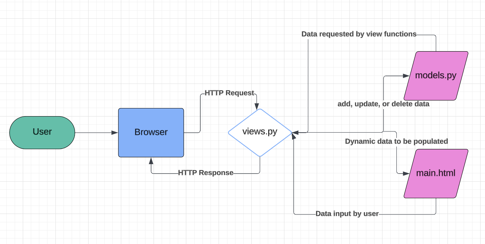
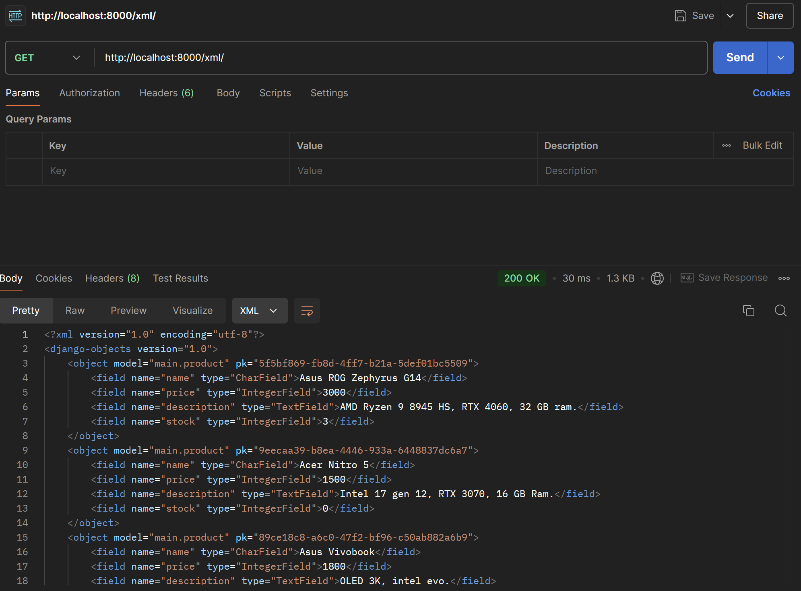
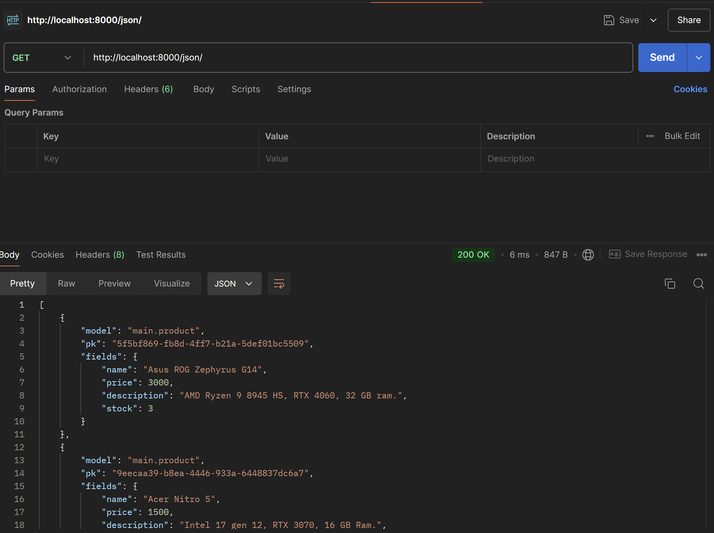
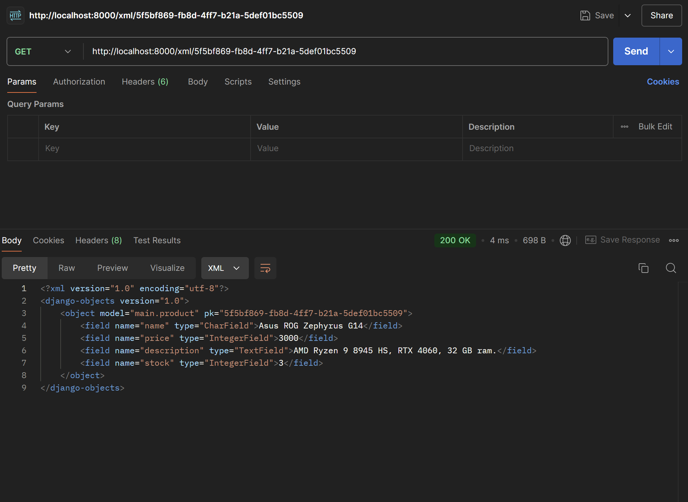
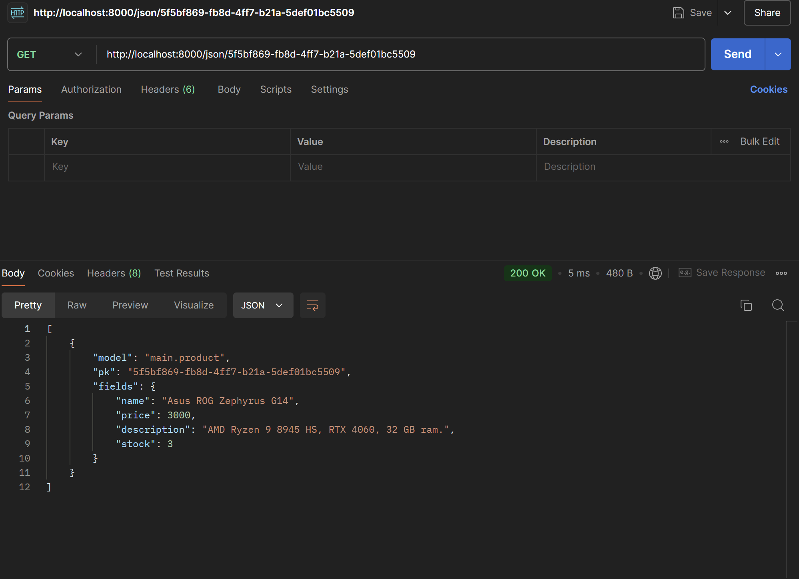

# Tech Bazaar
- [Tugas 2](#tugas-2)
- [Tugas 3](#tugas-3)
## Tugas 2
### Langkah-langkah mengimplementasikan *checklist* pada tugas 2
- Buat  *virtual environment* dengan menjalankan perintah `python -m venv env` pada direktori yang diiginkan. Misal di direktori `tech-bazaar`.
- Aktifkan *virtual environment* dengan perintah `env\Scripts\activate`.
- Di dalam direktori yang sama, buat berkas `requirements.txt` dan tambahkan beberapa *dependencies*.
    ```
    django
    gunicorn
    whitenoise
    psycopg2-binary
    requests
    urllib3
    ```
- Lakukan instalasi terhadap *dependencies* yang ada dengan perintah `pip install -r requirements.txt`.
- Buat proyek Django bernama `tech_bazaar` dengan perintah `django-admin startproject tech_bazaar .`.
- Tambahkan kedua string berikut pada `ALLOWED_HOSTS` di `settings.py` untuk keperluan deployment:
    ```
    ...
    ALLOWED_HOSTS = ["localhost", "127.0.0.1"]
    ...
    ```
- Tambahkan juga `'main'` ke dalam daftar aplikasi yang ada sebagai elemen paling terakhir. Daftar aplikasi dapat  diakses pada variabel INSTALLED_APPS.
    ```
    INSTALLED_APPS = [
        ...,
        'main'
    ]
    ```
- Buat aplikasi dengan nama `main` menggunakan perintah `python manage.py startapp main`. Perhatikan bahwa tercipta direktori baru `main`.
- Buka berkas `models.py` pada direktori aplikasi `main`.
- Isi berkas `models.py` dengan kode berikut.
    ```py
    from django.db import models

    class Product(models.Model):
        name = models.CharField(max_length=255)
        price = models.IntegerField()
        description = models.TextField()
        stock = models.IntegerField()

        @property
        def is_expensive(self):
            return self.price>2000
        
        @property
        def is_available(self):
            return self.stock>0

    ```
- Jalankan perintah `python manage.py makemigrations` untuk membuat migrasi model.
- Jalankan perintah `python manage.py migrate` untuk menerapkan migrasi ke dalam basis data lokal.
- Buka berkas `views.py` yang terletak di dalam berkas aplikasi `main`.
- Isi berkas `views.py` dengan kode berikut.
    ```py
    from django.shortcuts import render

    def show_main(request):
        context = {
            'app_name' : 'Tech Bazaar',
            'name' : 'Daffa Rayhan Ananda',
            'class' : 'PBP-E'
        }

        return render(request, "main.html", context)

    ```
- Buat direktori `templates` di dalam direktori `main`.
- Buat berkas `main.html` di dalam direktori `templates` dan isilah berkas tersebut dengan teks berikut.
    ```html
    ...
    <h1>Tech Bazaar</h1>

    <h5>App Name: </h5>
    <p>{{ app_name }}</p> 
    <h5>Name: </h5>
    <p>{{ name }}</p> 
    <h5>Class: </h5>
    <p>{{ class }}</p>
    ...
    ```
- Buat berkas `urls.py` di dalam direktori `main`.
- Isi `urls.py` dengan kode berikut.
    ```py
    from django.urls import path
    from main.views import show_main

    app_name = 'main'

    urlpatterns = [
        path('', show_main, name='show_main'),
    ]
    ```
- Buka berkas `urls.py` **di dalam direktori proyek `tech_bazaar`, bukan yang ada di dalam direktori aplikasi `main`**.
- Impor fungsi `path` dan `include` dari `django.urls`.
    ```
    ...
    from django.urls import path, include
    ...
    ```
-  Tambahkan rute URL seperti berikut untuk mengarahkan ke tampilan `main` di dalam variabel `urlpatterns`.
    ```
    urlpatterns = [
        ...
        path('', include('main.urls')),
        ...
    ]
    ```
- Pada direktori utama `tech-bazaar` lakukan perintah `git init` untuk menetapkan direktori ini sebagai *repository* lokal.
- Tambahkan berkas `.gitignore` dan isilah berkas tersebut dengan teks berikut.
    ```
    # Django
    *.log
    *.pot
    *.pyc
    __pycache__
    db.sqlite3
    media

    # Backup files
    *.bak

    # If you are using PyCharm
    # User-specific stuff
    .idea/**/workspace.xml
    .idea/**/tasks.xml
    .idea/**/usage.statistics.xml
    .idea/**/dictionaries
    .idea/**/shelf

    # AWS User-specific
    .idea/**/aws.xml

    # Generated files
    .idea/**/contentModel.xml
    .DS_Store

    # Sensitive or high-churn files
    .idea/**/dataSources/
    .idea/**/dataSources.ids
    .idea/**/dataSources.local.xml
    .idea/**/sqlDataSources.xml
    .idea/**/dynamic.xml
    .idea/**/uiDesigner.xml
    .idea/**/dbnavigator.xml

    # Gradle
    .idea/**/gradle.xml
    .idea/**/libraries

    # File-based project format
    *.iws

    # IntelliJ
    out/

    # JIRA plugin
    atlassian-ide-plugin.xml

    # Python
    *.py[cod]
    *$py.class

    # Distribution / packaging
    .Python build/
    develop-eggs/
    dist/
    downloads/
    eggs/
    .eggs/
    lib/
    lib64/
    parts/
    sdist/
    var/
    wheels/
    *.egg-info/
    .installed.cfg
    *.egg
    *.manifest
    *.spec

    # Installer logs
    pip-log.txt
    pip-delete-this-directory.txt

    # Unit test / coverage reports
    htmlcov/
    .tox/
    .coverage
    .coverage.*
    .cache
    .pytest_cache/
    nosetests.xml
    coverage.xml
    *.cover
    .hypothesis/

    # Jupyter Notebook
    .ipynb_checkpoints

    # pyenv
    .python-version

    # celery
    celerybeat-schedule.*

    # SageMath parsed files
    *.sage.py

    # Environments
    .env
    .venv
    env/
    venv/
    ENV/
    env.bak/
    venv.bak/

    # mkdocs documentation
    /site

    # mypy
    .mypy_cache/

    # Sublime Text
    *.tmlanguage.cache
    *.tmPreferences.cache
    *.stTheme.cache
    *.sublime-workspace
    *.sublime-project

    # sftp configuration file
    sftp-config.json

    # Package control specific files Package
    Control.last-run
    Control.ca-list
    Control.ca-bundle
    Control.system-ca-bundle
    GitHub.sublime-settings

    # Visual Studio Code
    .vscode/*
    !.vscode/settings.json
    !.vscode/tasks.json
    !.vscode/launch.json
    !.vscode/extensions.json
    .history
    ```
- Akses halaman PWS pada https://pbp.cs.ui.ac.id dan lakukan registrasi menggunakan SSO.
- Buat proyek baru dengan menekan tombol `Create New Project`.
- Isi `Project Name` dengan `techbazaar`. Setelah itu, tekan Create New Project di bawahnya.
- Simpan *credentials* di tempat yang aman.
- Pada `settings.py` di proyek Django yang sudah dibuat tadi, tambahkan URL deployment PWS pada `ALLOWED_HOSTS`.
    ```
    ...
    ALLOWED_HOSTS = ["localhost", "127.0.0.1", "daffa-rayhan-techbazaar.pbp.cs.ui.ac.id"]
    ...
    ```
- Jalankan perintah yang terdapat pada informasi Project Command pada halaman PWS.

### Bagan


### Fungsi Git Dalam Pengembangan Perangkat Lunak
- Menyimpan *history* perubahan dalam suatu proyek.
- Menggabungkan dua kondisi proyek berbeda (*branch* berbeda). 
- Untuk mempermudah kerja sama tim.

### Kenapa Django?
Django memiliki komponen yang jelas dan mudah diterapkan. Django juga memiliki banyak fitur yang sangat berguna dalam pengembangan proyek. Django sangat cocok untuk pemula.

### Alasan Model Django disebut Sebagai ORM
ORM (Object-relational Mapping) adalah teknik pemrograman untuk mengkonversi data antara *relational database* dan bahasa pemrograman yang menerapkan *object-oriented programming* (OOP) seperti python. Model Django berfungsi sebagai penghubung antara objek dalam kode python dengan *relational database*. Salah satu contohnya, kita dapat lihat berkas `urls.py`yang melakukan routing ke *database*. Dengan ini, model Django dapat disebut sebagai ORM.

## Tugas 3
### Jelaskan mengapa kita memerlukan *data delivery* dalam pengimplementasian sebuah platform?
*Data delivery* diperlukan dalam pengembangan platform dikarenakan kebutuhan untuk mengirim, menerima, dan meproses informasi pada platform. Salah satu contohnya adalah proses *HTTP request* dan *HTTP response*, diperlukan *data delivery* untuk mengirim permintaan pengguna dan merespon permintaan tersebut pada *browser*.

### Menurutmu, mana yang lebih baik antara XML dan JSON? Mengapa JSON lebih populer dibandingkan XML?
Menurut saya sendiri JSON lebih baik daripada XML karena kode JSON cenderung lebih pendek. Ada beberapa alasan JSON lebih populer dibandingkan XML:
1. JSON dapat di-*parse* dengan fungsi *JavaScript* standar, sedangkan untuk *parse* XML, diperlukan XML *parser*.
2. JSON lebih sederhana dan fleksibel.
3. JSON memiliki ukuran *file* yang lebih kecil dan pengiriman data yang lebih cepat jika dibandingkan dengan XML.

### Jelaskan fungsi dari method `is_valid()` pada form Django dan mengapa kita membutuhkan method tersebut?
Fungsi dari method`is_valid` pada form Django adalah untuk memvalidasi form yang diisi pengguna pada *browser*. Method diperlukan karena bisa saja pengguna mengisi data yang tidak valid pada form, misalnya seperti string kosong.

### Mengapa kita membutuhkan `csrf_token` saat membuat form di Django? Apa yang dapat terjadi jika kita tidak menambahkan `csrf_token` pada form Django? Bagaimana hal tersebut dapat dimanfaatkan oleh penyerang?
Kita membutuhkan `csrf_token` saat membuat form di Django untuk menghindari serangan CSRF yang cukup berbahaya. Jika kita tidak menambahkan `csrf_token` pada form Django, kita bisa saja diarahkan ke web palsu oleh penyerang. Penyerang dapat memanfaatkan tidak adanya `csrf_token` dengan memberikan tautan dalam bentuk form. Dengan ini, penyerang dapat menipu pengguna dengan melakukan beberapa aksi, seperti transfer dana, pengubahan alamat email, dan lain-lain. 

### Jelaskan bagaimana cara kamu mengimplementasikan checklist di atas secara step-by-step (bukan hanya sekadar mengikuti tutorial).
1. Membuat input `form` untuk menambahkan objek model pada app sebelumnya.
    * Buat berkas [`main/forms.py`](main/forms.py) untuk mendefinisikan input form. 
    * Tambahkan fungsi `create_product()` pada berkas [`main/views.py`](main/views.py) sebagai fungsi untuk menambahkan objek ketika menerima form. 
    * Tambahkan dan perbarui berkas template [`templates/base.html`](templates/base.html), [`main/templates/main.html`](main/templates/main.html), dan [`main/templates/create_product.html`](main/templates/create_product.html) untuk menampilkan informasi-informasi pada web.
2. Tambahkan 4 fungsi `views` baru untuk melihat objek yang sudah ditambahkan dalam format XML, JSON, XML *by ID*, dan JSON *by ID*.
    * Cukup tambahkan fungsi `show_xml()`, `show_json()`, `show_xml_by_id()`, dan `show_json_by_id()` pada berkas [`main/views.py`](main/views.py) untuk menampilkan objek dalam format XML atau JSON.
3. Membuat routing URL untuk masing-masing `views` yang telah ditambahkan pada poin 2.
    * Pada berkas [`main/urls.py`](main/urls.py), impor 4 fungsi `show_xml()`, `show_json()`, `show_xml_by_id()`, dan `show_json_by_id()` yang telah didefinisikan pada berkas [`main/views.py`](main/views.py) sebelumnya.
    * Di dalam list `urlspatterns`, tambahkan:
        * ```py
            path('xml/', show_xml, name='show_xml')
            ```
            untuk melihat objek dalam format XML;
        * ```py
            path('json/', show_json, name='show_json')
            ```
            untuk melihat objek dalam format JSON;
        * ```py
            path('xml/<str:id>/', show_xml_by_id, name='show_xml_by_id')
            ```
            untuk melihat objek dalam format XML *by id*;
        * ```py
            path('json/<str:id>/', show_json_by_id, name='show_json_by_id')
            ```
            untuk melihat objek dalam format JSON *by id*.

### Hasil keempat URL di poin 2 menggunakan Postman
1. Hasil XML

2. Hasil JSON

3. Hasil XML *by id*

4. Hasil JSON *by id*

